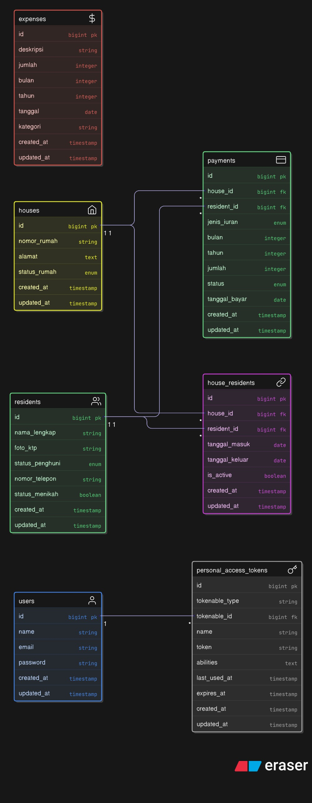

# ERD - Full-House

## Relasi

**houses <-> residents** — Many-to-Many lewat tabel `house_residents`. Satu rumah bisa punya beberapa penghuni sekaligus, dan satu penghuni bisa pindah rumah. Tabel pivot-nya nyimpen histori: kapan masuk, kapan keluar, dan apakah masih aktif.

**houses -> payments** — One-to-Many. Tagihan iuran nempel ke rumah, bukan ke orang. Jadi kalau penghuni pindah, tagihan tetap tercatat per rumah.

**residents -> payments** — Optional. Kolom `resident_id` nullable karena tagihan yang di-generate otomatis belum tentu ada penghuni spesifik yang bayar. Kalau dicatat manual baru bisa diisi siapa yang bayar.

**expenses** — Berdiri sendiri, tidak relasi ke tabel lain. Ini untuk catat pengeluaran RT seperti gaji satpam, listrik, perbaikan, dll.

**users -> personal_access_tokens** — Sanctum punya, untuk autentikasi API pakai Bearer token. Satu user bisa login dari beberapa device.

## Catatan Kolom

| Tabel | Kolom | Catatan |
|-------|-------|---------|
| residents | status_penghuni | `tetap` = pemilik, `kontrak` = penyewa/ngontrak |
| residents | foto_ktp | Path file KTP yang diupload, nullable |
| houses | status_rumah | Otomatis berubah waktu assign/remove penghuni |
| house_residents | is_active | Penanda penghuni aktif, bisa lebih dari satu per rumah |
| payments | jenis_iuran | `satpam` atau `kebersihan` |
| payments | resident_id | Nullable — tagihan per rumah, bukan per orang |
| expenses | kategori | Free text (Gaji Satpam, Perbaikan Jalan, dll) |
